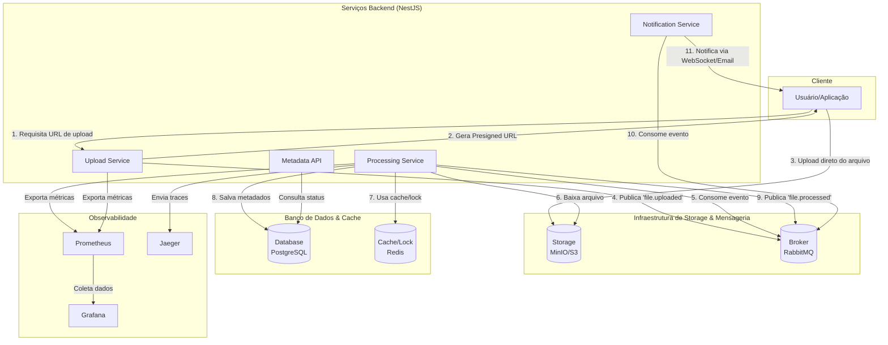

# SyncFlow: Sistema de Sincronização e Processamento de Arquivos em Alta Escala 

> Em desenvolvimento

<!--  -->

**SyncFlow** é uma plataforma de backend robusta, projetada para gerenciar o upload e processamento assíncrono de um volume massivo de arquivos. O projeto simula arquiteturas distribuídas e orientadas a eventos encontradas em empresas de tecnologia de ponta, servindo como uma peça central de portfólio para demonstrar habilidades em engenharia de software escalável.

## Objetivo

O objetivo é criar um sistema que resolva desafios comuns em pipelines de dados e serviços corporativos, como:
- **Ingestão de Dados (ETL):** Receber arquivos e prepará-los para sistemas de análise.
- **Processamento de Mídia:** Gerar thumbnails, extrair metadados e transcodificar vídeos.
- **Análise de Logs:** Consumir, processar e arquivar logs de sistemas.
- **Orquestração de Eventos:** Disparar ações complexas a partir de um simples upload.

## Arquitetura Geral

O sistema é composto por um conjunto de microsserviços independentes que se comunicam através de um message broker, garantindo desacoplamento e resiliência.



## Fluxo do Sistema

1.  **Requisição de Upload:** O cliente solicita ao **Upload Service** uma URL para enviar um arquivo.
2.  **Upload Direto:** O cliente recebe uma **Presigned URL** e envia o arquivo diretamente para o **Storage (MinIO/S3)**, evitando sobrecarga na API.
3.  **Evento de Upload:** O **Upload Service** publica o evento `file.uploaded` no **RabbitMQ**.
4.  **Processamento Assíncrono:** O **Processing Service**, um consumidor da fila, pega a tarefa. Ele usa um lock distribuído no **Redis** para garantir que o arquivo seja processado apenas uma vez.
5.  **Extração de Metadados:** O serviço baixa o arquivo, extrai metadados (tamanho, hash, dimensões, etc.) e salva os resultados no **PostgreSQL**.
6.  **Evento de Conclusão:** Ao finalizar, publica o evento `file.processed` no RabbitMQ.
7.  **Notificação:** O **Notification Service** consome o evento final e notifica o cliente (via WebSocket, Email, etc.) sobre o sucesso ou falha.
8.  **Consulta:** A qualquer momento, o cliente pode consultar o status dos arquivos através da **Metadata API**.

## Funcionalidades Principais

-   ✔️ **Upload com Presigned URLs:** Desacopla o tráfego de upload da aplicação principal.
-   ✔️ **Processamento Assíncrono e Concorrente:** Workers configuráveis para processar múltiplos arquivos em paralelo.
-   ✔️ **Resiliência e Confiabilidade:** Mecanismos de `Retry` e `Dead-Letter Queue (DLQ)` para lidar com falhas.
-   ✔️ **Lock Distribuído:** Garante a idempotência e previne processamento duplicado em ambientes com múltiplas réplicas.
-   ✔️ **API REST Completa:** Endpoints para consulta de status com filtros, paginação e ordenação.
-   ✔️ **Observabilidade Avançada:**
    -   **Métricas:** Monitoramento em tempo real com **Prometheus** (latência, jobs em progresso, taxa de erros).
    -   **Tracing Distribuído:** Visibilidade ponta-a-ponta do ciclo de vida de uma requisição com **OpenTelemetry** e **Jaeger**.
    -   **Logs Estruturados:** Logs em formato JSON para fácil agregação e análise.

## 🛠️ Stack de Tecnologias

| Área                  | Tecnologia                               |
| --------------------- | ---------------------------------------- |
| **Backend**           | NestJS (Monorepo com Nx)                 |
| **Banco de Dados**    | PostgreSQL                               |
| **ORM**               | Prisma                                   |
| **Mensageria**        | RabbitMQ                                 |
| **Cache & Locks**     | Redis                                    |
| **Storage de Arquivos**| MinIO (Compatível com AWS S3)            |
| **Observabilidade**   | Prometheus, Grafana, Jaeger, OpenTelemetry |
| **Containerização**   | Docker & Docker Compose                  |
| **Orquestração**      | Kubernetes (Deployments, Services, HPA)  |
| **CI/CD**             | GitHub Actions                           |

## Como Executar Localmente

1.  **Pré-requisitos:**
    *   Node.js (v20+)
    *   Yarn
    *   Docker e Docker Compose

2.  **Clone o repositório:**
    ```bash
    git clone https://github.com/Alysson-Araujo/syncflow.git
    cd syncflow
    ```

3.  **Instale as dependências:**
    ```bash
    yarn install
    ```

4.  **Configure as variáveis de ambiente:**
    Copie o arquivo de exemplo e, se necessário, ajuste os valores.
    ```bash
    cp .env.example .env
    ```

5.  **Inicie a infraestrutura (bancos, broker, etc.):**
    ```bash
    docker-compose up -d
    ```

6.  **Aplique as migrações do banco de dados:**
    ```bash
    npx prisma migrate dev
    ```

7.  **Inicie uma das aplicações (ex: Upload Service):**
    ```bash
    yarn start:dev upload-service
    ```

## Estrutura do Projeto (Monorepo)

Este projeto utiliza uma estrutura de monorepo para facilitar o compartilhamento de código e o gerenciamento de dependências.

-   `apps/`: Contém o código de cada microsserviço independente (`upload-service`, `processing-service`, etc.).
-   `libs/`: Contém bibliotecas compartilhadas entre os serviços (DTOs, módulos de configuração, entidades Prisma, etc.).
-   `prisma/`: Contém o schema do banco de dados, que é a fonte única da verdade para a estrutura de dados.
